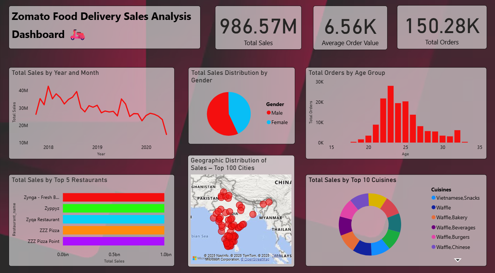

## 🍽️ Zomato Food Delivery Sales Analysis Dashboard

### 📌 Overview
This Power BI dashboard analyzes Zomato food delivery sales data to understand **sales trends,
customer demographics, top restaurants, popular cuisines, and geographic distribution of orders**.
It provides quick insights to support data-driven business decisions.

---

### ❓ Problem Statement
Analyzing large food delivery datasets manually makes it difficult to identify trends and
high-performing segments.  
This dashboard helps visualize sales performance, customer behavior, and ordering patterns
to improve business strategy and operational efficiency.

---

### 📊 Dataset
The analysis is based on multiple datasets, including:
- Orders data
- Users data
- Restaurants data
- Food data

All datasets were cleaned, transformed, and modeled using **Power BI**.

---

### 📈 Key Performance Indicators (KPIs)
- **Total Sales:** 986.57M  
- **Total Orders:** 150.28K  
- **Average Order Value:** 6.56K  

---

### 🔍 Dashboard Insights
- Sales show noticeable variation across different **years and months**
- **Male customers** contribute a higher share of total sales compared to female customers
- The **age group of 22–26 years** places the highest number of orders
- Certain restaurants consistently generate higher sales than others
- Sales are concentrated in **major cities across India**
- A few cuisines dominate overall sales among the top 10 cuisines

---

### 🛠️ Tools & Technologies
- **Power BI**
- **Microsoft Excel**
- Data Cleaning & Data Modeling
- Interactive Visualizations

---

### 📷 Dashboard Preview

---

📌 **Note:** Due to GitHub file size limitations, the Power BI (.pbix) file is not uploaded.
It can be shared upon request.
