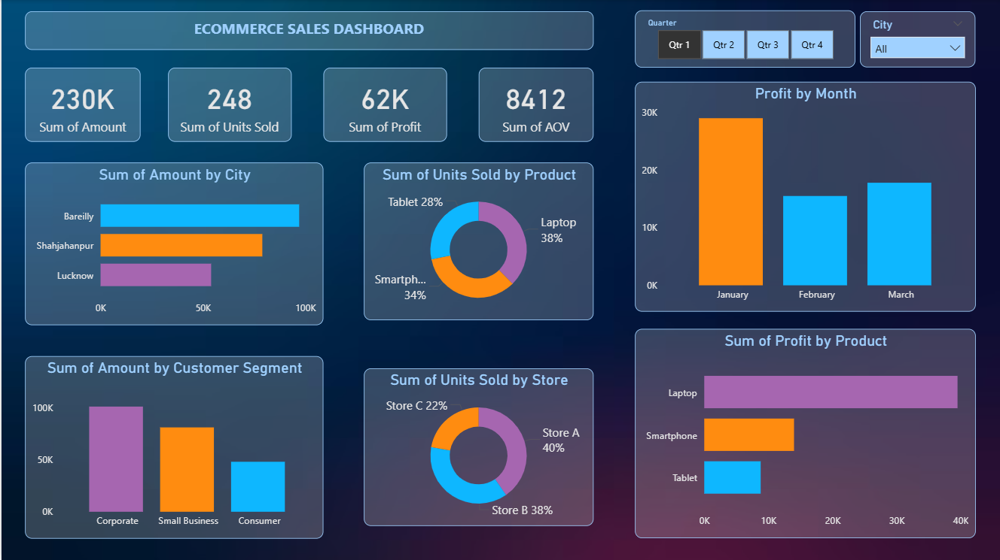
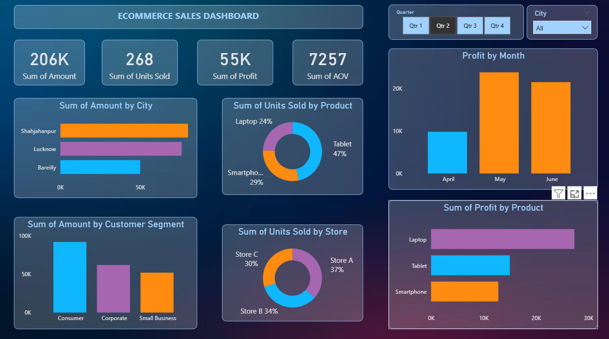
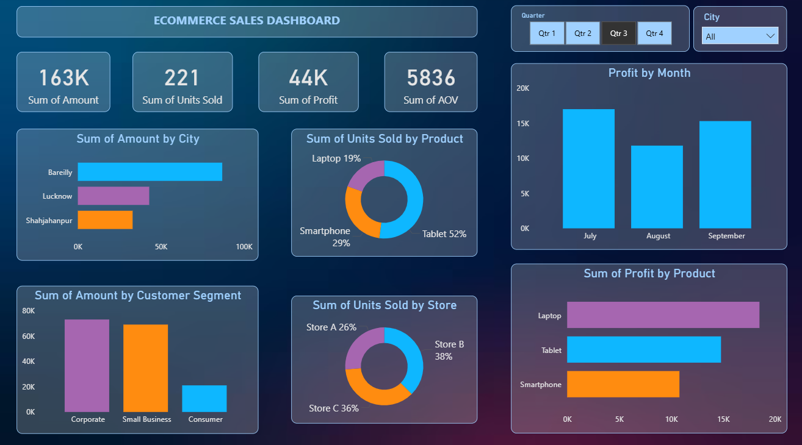
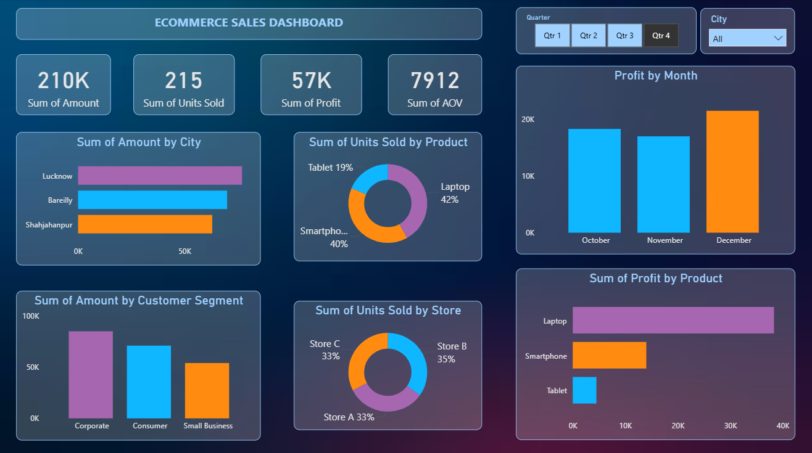

## 🛒 E-Commerce Sales Dashboard

### 📌 Overview
This dashboard provides a comprehensive analysis of e-commerce sales performance
across different **quarters, cities, products, customer segments, and stores**. 
It is designed to help business stakeholders track revenue, profitability, and sales trends for better decision-making.

---

### 🎯 Problem Statement
To analyze e-commerce sales data in order to:
- Monitor overall sales and profit performance
- Understand product-wise and city-wise contribution
- Identify customer segment behavior
- Track monthly and quarterly trends

---

### 📂 Dataset
- Source: CSV file
- Data includes:
  - Sales amount
  - Units sold
  - Profit
  - Product categories (Laptop, Smartphone, Tablet)
  - Cities (Bareilly, Lucknow, Shahjahanpur)
  - Customer segments (Consumer, Corporate, Small Business)
  - Store details (Store A, B, C)
  - Monthly and quarterly time data

---

### 📊 Key KPIs
- **Total Sales Amount**
- **Total Units Sold**
- **Total Profit**
- **Average Order Value (AOV)**

---

### 📈 Dashboard Analysis & Visuals
- **Quarter-wise analysis** using slicers (Q1–Q4)
- **City-wise sales distribution**
- **Product-wise units sold and profit comparison**
- **Monthly profit trends**
- **Customer segment contribution to revenue**
- **Store-wise units sold distribution**

---

### 🔍 Key Insights
- Sales and profit vary significantly across different quarters
- **Laptops and Smartphones** contribute the highest share of profit
- Certain cities consistently outperform others in total sales
- **Corporate and Consumer segments** generate higher revenue
- Monthly profit trends highlight peak and low-performing periods
- Store-level analysis helps identify top-performing stores

---

### 🖼 Dashboard Previews

#### 🔹 Dashboard View 1

#### 🔹 Dashboard View 2

#### 🔹 Dashboard View 3

#### 🔹 Dashboard View 4

